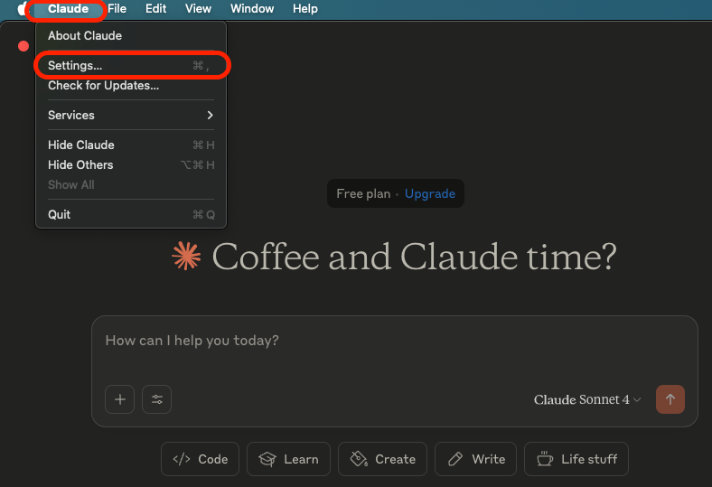
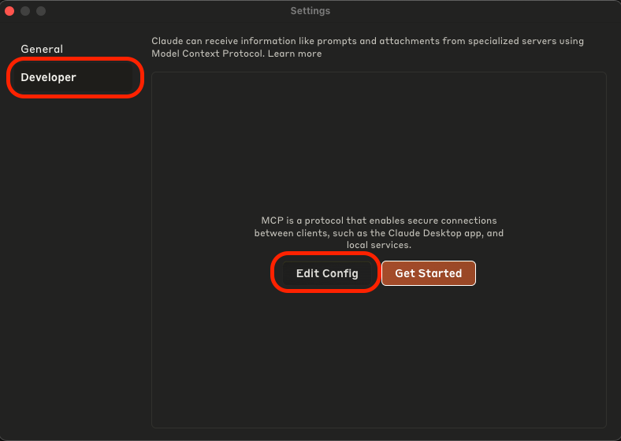
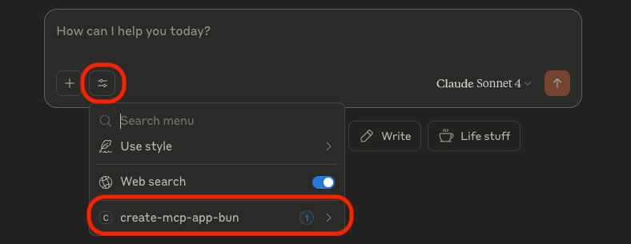
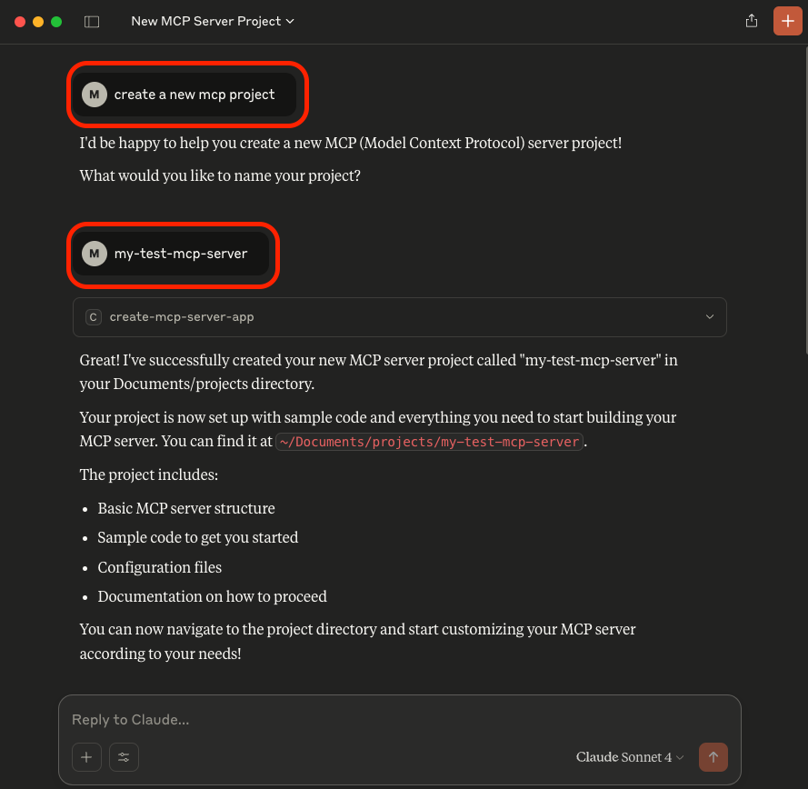

# MCP Server

MCP server providing functionality to set up your own MCP server project using Bun.

- [MCP Server](#mcp-server)
  - [Background](#background)
  - [Prerequisites](#prerequisites)
  - [Setup Project](#setup-project)
  - [Build](#build)
  - [Setup Claude Desktop](#setup-claude-desktop)
  - [Usage](#usage)

## Background

This project utilizes Model Context Protocol (MCP) to facilitate a standardized tool (MCP server) to create a sample MCP project in a predefined location.

In this example, we are integrating with Claude Desktop to run the MCP server and at the same time act as MCP client to interact with the MCP server.

The sample project generated follows the same structure as this project with some limitations in terms of generated code and configurations (e.g. no tests, no advanced logging).

The choice to use Bun instead of NodeJS was intentional to also showcase that Bun has made significant strides towards becoming a true alternative to NodeJS. It is lightning fast, easy to set up and comes with a lot of functionality out of the box. It also integrates well with existing tool chains, such as ESLint and others.

## Prerequisites

1. [Bun](https://bun.sh/docs/installation#installing) must be installed.
2. [Claude Desktop](https://claude.ai/download) should be installed.

## Setup Project

1. Clone the repository.
2. Run:

   ```sh
   bun install
   ```

3. _(Optional)_ Run the following to verify integrity of the project:

   ```sh
   bun run verify
   ```

## Build

1. Run:

   ```sh
   bun run build
   ```

This will bundle all code into a single `build/main.js` that can be consumed.

## Setup Claude Desktop

This section is influenced by this general [guide](https://modelcontextprotocol.io/quickstart/user) with specifics for this use case.

1. Start Claude Desktop and open Settings
   
2. Click on `Developer` in the left-hand bar of the Settings pane, and then click on `Edit Config`:
   
3. Edit the file `claude_desktop_config.json` and add the following:

   ```json
   {
     "mcpServers": {
       "create-mcp-app-bun": {
         "command": "bun",
         "args": ["run", "<path_to_project>/build/main.js"]
       }
     }
   }
   ```

   Replace <path_to_project> with the path to your project; e.g.: `/Users/username/Documents/projects/create-mcp-server-app-bun`

4. Restart Claude Desktop; this is important as Claude Desktop will otherwise not apply changes to `claude_desktop_config.json`.
5. On the main screen, click the `Search and Tools` button and then on your MCP server name:

   
   

Ensure that it is enabled.

## Usage

1. You can start by simply asking Claude to create a new MCP project: `create a new mcp project`

   Claude will in response ask you to specify a name (e.g. `my-test-mcp-server`), after which it creates the project.

   

2. The implementation will also handle situations correctly where the project already exists and prompt the user to specify the follow-up action.
